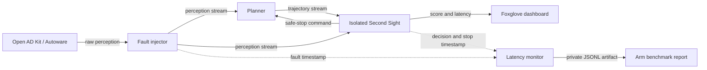

# Second Sight

An independent anomaly detector for silent perception failures in autonomous
driving systems. The Second Sight observes ROS 2 perception and planning streams,
scores each tick, and requests a safe stop when behavior becomes anomalous.

This repository is an early development scaffold for the Arm Create: AI
Optimization Challenge. See [`docs/brief.md`](docs/brief.md) for the full build
brief. The full hackathon requirements and judging criteria are preserved in
[`docs/arm-ai-optimization-challenge-2026.md`](docs/arm-ai-optimization-challenge-2026.md).

> Performance figures belong here only after they have been measured on Arm
> Linux. macOS results are for development correctness, not submission claims.

## Architecture



The model and feature code will stay ROS-independent. Thin ROS 2 adapters will
handle messages in the fault injector and Second Sight containers, allowing the
core logic to be tested on macOS and deployed unchanged to Arm Linux.

## Mac Quick Start

Prerequisites: Apple Silicon, Docker Desktop, Homebrew, and `uv`.

```bash
uv sync
uv run second-sight doctor
uv run pytest
uv run ruff check .
```

Run a publisher/subscriber smoke test inside two ROS 2 Humble containers:

```bash
./scripts/ros-smoke.sh
```

The first ROS smoke test downloads the ROS image and can take several minutes.
To download and start the full Open AD Kit demo on Apple Silicon:

```bash
./scripts/openadkit.sh pull
./scripts/openadkit.sh start
```

Open <http://localhost:6080/vnc.html> and use password `openadkit`. See
[`docs/mac-setup.md`](docs/mac-setup.md) for controls, setup details, and
limitations.

## Repository Layout

```text
components/       ROS-facing deployable components
src/second_sight/  portable feature, model, and evaluation code
tests/            portable unit tests
configs/          versioned experiment and fault-scenario configuration
data/             local bag-derived datasets (large files are ignored)
models/           local trained/quantized models (artifacts are ignored)
reports/          benchmark methodology and measured Arm results
scripts/          repeatable development commands
docs/             project brief and developer documentation
```

## Current Milestone

Completed: ROS 2 container workflow, Open AD Kit scenario, clean bag capture,
portable event export, deterministic implementations of all six fault modes,
32-feature extraction, and normal-only baseline/hybrid evaluation. The current
model uses 30 validated features and retains two tracking features as
experimental telemetry. Run the
combined scenario with:

```bash
uv run second-sight inject \
  data/processed/openadkit-clean-20260716T112843Z.jsonl \
  --scenario configs/scenarios/all-faults.yaml \
  --output data/processed/openadkit-all-faults.jsonl
```

The hybrid detects all six injected faults in the current fixed-route replay;
see [`reports/baseline.md`](reports/baseline.md). The live injector, Second Sight,
simulator remap, Foxglove transport, and a measurement-only fault-to-safe-stop
timing harness are integrated. The next milestone is repeated live measurement
on Arm Linux plus evaluation on varied routes before any end-to-end performance
or general detection-rate claim.

The first no-leakage `pass`/`fail` planner-configuration validation is now
recorded in
[`reports/heldout-configuration-validation.md`](reports/heldout-configuration-validation.md).
It detects the deterministic test faults but exposes an unacceptable 3.183–8.300%
clean false-positive rate, so it is diagnostic evidence rather than a deployment
claim. Candidate route variants are versioned in
[`configs/scenarios/route-variants.yaml`](configs/scenarios/route-variants.yaml)
and generated with `./scripts/openadkit.sh generate-routes`; each must be
simulator-validated before it is used to collect data. Their current validation
status and retry protocol are in
[`docs/route-variants.md`](docs/route-variants.md). Genuinely varied routes
remain the next required data milestone.

Two Arm-validated traffic-speed profiles now supplement the north-approach
route; their scope and stream counts are recorded in
[`reports/traffic-variant-validation.md`](reports/traffic-variant-validation.md).

The integrated stack includes Foxglove Bridge at `ws://localhost:8765`; see
[`components/dashboard/README.md`](components/dashboard/README.md).

Use `./scripts/openadkit.sh dashboard-start` for a lightweight, continuously
animated dashboard on the Mac.

An overnight clean-data collection can run independently with:

```bash
./scripts/collect-clean.sh start 8
./scripts/collect-clean.sh status
```

The measured development interfaces are recorded in
[`docs/interfaces.md`](docs/interfaces.md).
Native Arm benchmark methodology is in
[`docs/benchmarking.md`](docs/benchmarking.md).
The initial official Arm Performix System Utilization and Code Hotspots profiles
are recorded in
[`reports/arm-performix-initial-profile.md`](reports/arm-performix-initial-profile.md).
The Performix-led guardrail-only fast-path optimization and its native-Arm A/B
result are recorded in
[`reports/arm-guardrail-fast-path-optimization.md`](reports/arm-guardrail-fast-path-optimization.md).
Its 82.7× p50 scoring reduction applies only to the opt-in perception
guardrail path, not to end-to-end safe-stop latency or hybrid scoring.
The post-optimization five-run-per-fault live Arm validation is in
[`reports/arm-optimized-fast-path-live-validation.md`](reports/arm-optimized-fast-path-live-validation.md).
It measures safe-stop-request issuance on one host and explicitly excludes
teleport, cross-machine latency, and vehicle response.
The current scoring-only Arm baseline is recorded in
[`reports/arm-inference-baseline.md`](reports/arm-inference-baseline.md). The
first Arm optimization comparison, reducing the forest from 300 to 25 trees,
is recorded in
[`reports/arm-25tree-optimization.md`](reports/arm-25tree-optimization.md).
The initial all-fault live Arm validation, including explicit statistical and
measurement limits, is in
[`reports/arm-live-latency-validation.md`](reports/arm-live-latency-validation.md).
The initial opt-in perception fast-path validation is in
[`reports/arm-fast-path-validation.md`](reports/arm-fast-path-validation.md);
the five-run-per-fault Arm validation is in
[`reports/arm-fast-path-repeated-validation.md`](reports/arm-fast-path-repeated-validation.md).
It explicitly excludes teleport from its fast-path percentiles. A separate,
single-run causal trajectory-hybrid teleport validation is recorded in
[`reports/arm-portable-teleport-validation.md`](reports/arm-portable-teleport-validation.md);
the repeated five-run development validation is in
[`reports/arm-portable-teleport-repeated-validation.md`](reports/arm-portable-teleport-repeated-validation.md).
The live end-to-end measurement protocol is in
[`docs/latency-instrumentation.md`](docs/latency-instrumentation.md).
Use [`scripts/capture-container-resources.sh`](scripts/capture-container-resources.sh)
alongside each live Arm run to retain the raw watchdog CPU and memory samples.
The measured AWS development-cost ledger and ongoing storage cost are in
[`docs/aws-costs.md`](docs/aws-costs.md).

## V2 safety-monitor work

The next version preserves the measured v1 25-tree hybrid and adds calibrated,
direct-perception checks for stream liveness, collapsed confidence, and stale
source frames. This is not yet a new benchmark claim: v2 requires a fresh
native-Arm final cohort on `straight-through-exit`, then frozen-model
evaluation and repeat integrated service-response trials. The executable
protocol and cost guardrail are in [`docs/v2-validation.md`](docs/v2-validation.md).

## License

[MIT](LICENSE)
